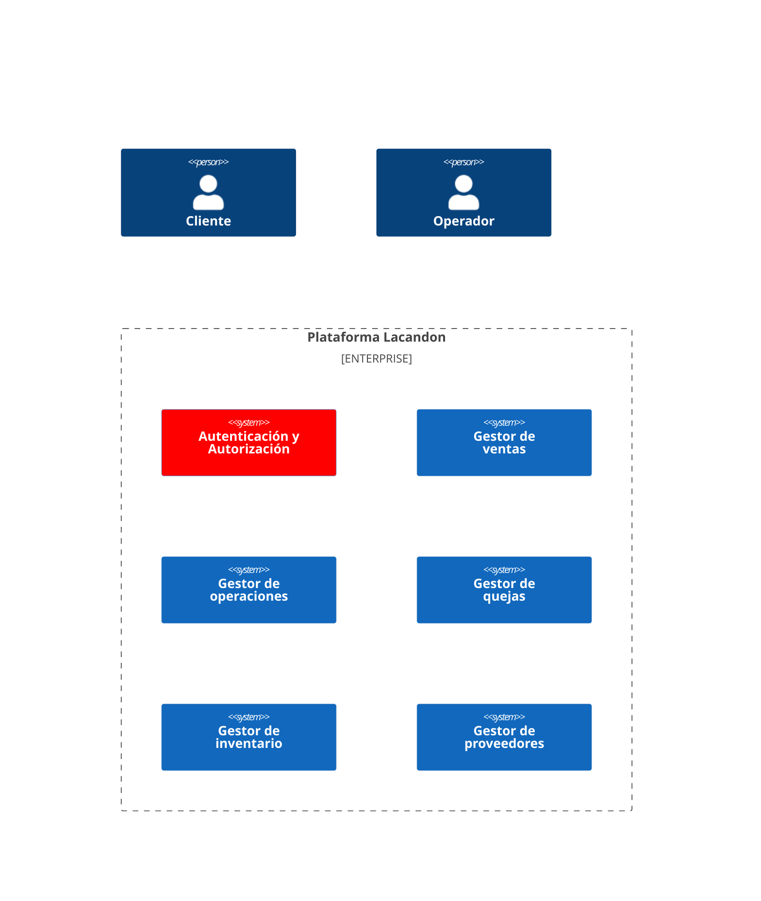
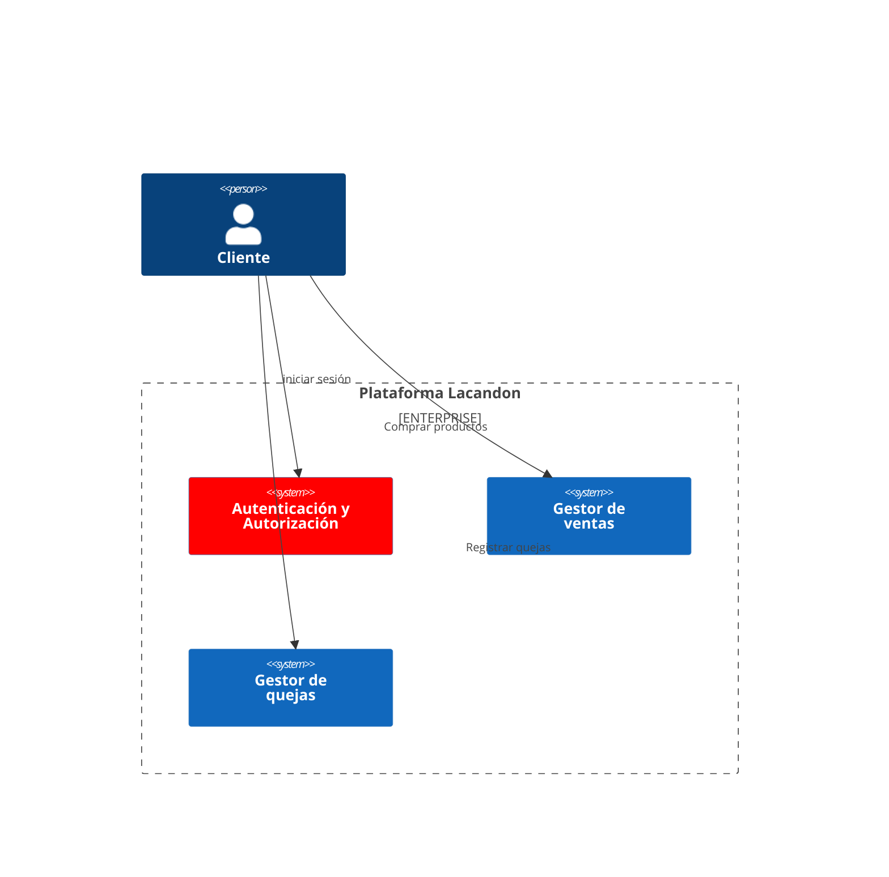
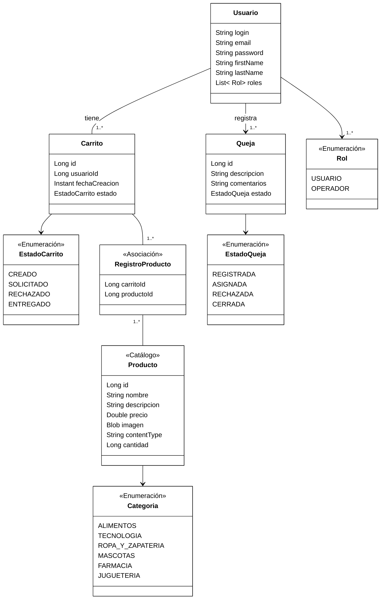
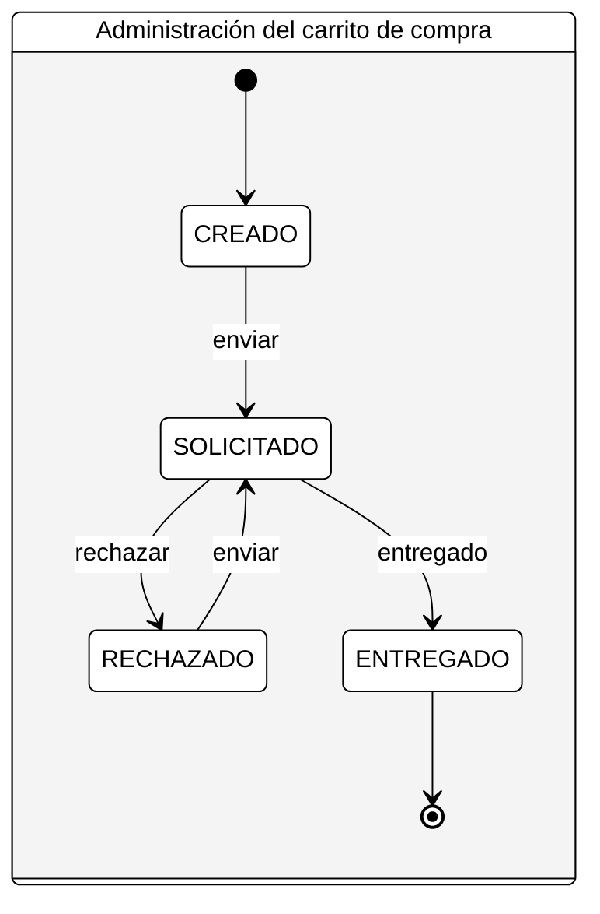
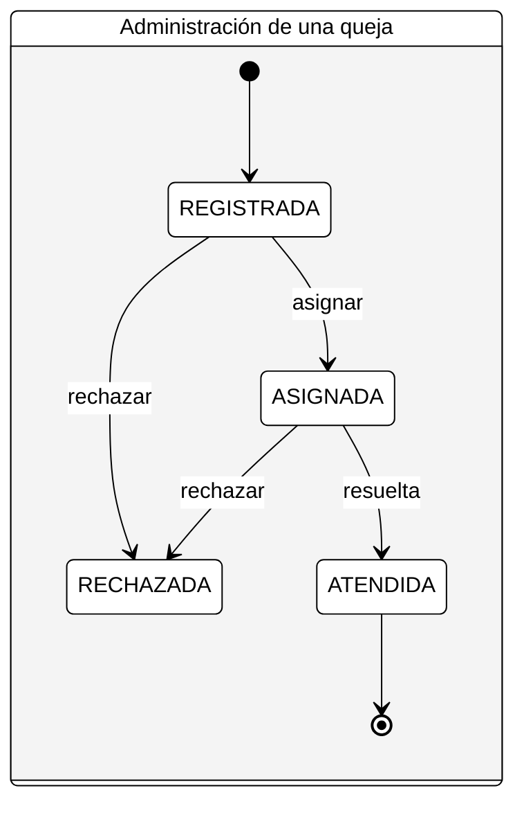

# Lacandon

## Diagrama de contexto para la plataforma

Un Diagrama de Contexto de Sistema (DCS) en Ingeniería de software e Ingeniería de sistemas es un diagrama que define los límites entre el sistema, o parte del sistema, y su ambiente, mostrando las entidades que interactúan con él.2​ Este diagrama es una vista de alto nivel de un sistema.

A continuación se muestra el diagrama de contexto para **Lacandon**:



Funcionalidades del **Cliente**



## Modelo de dominio

Un modelo de dominio es una representación de los conceptos, reglas y relaciones que definen un dominio de problema.

En la siguiente figura, se muestra el modelo de dominio simplificado para la plataforma **Lacandon**:




## Diagrama de estados

El diagrama de estados es un diagrama de comportamiento usado para especificar el comportamiento de una parte del sistema diseñado a través de transiciones de estados finitos. Es utilizado para mostrar los estados por los que pasa un componente de un sistema de información.

### Diagrama de estados para el carrito de compra

A continuación se muestra el diagrama de estados para el Objeto **Carrito de Compra**



### Diagrama de estados para la administración de una queja

A continuación se muestra el diagrama de estados para el Objeto **Queja**




```plantuml
@startuml
    skinparam backgroundColor #EEEBDC
    skinparam handwritten true
    actor Customer
    Customer -> "login()" : username & password
    "login()" -> Customer : session token
    activate "login()"
    Customer -> "placeOrder()" : session token, order info
    "placeOrder()" -> Customer : ok
    Customer -> "logout()"
    "logout()" -> Customer : ok
    deactivate "login()"
@enduml