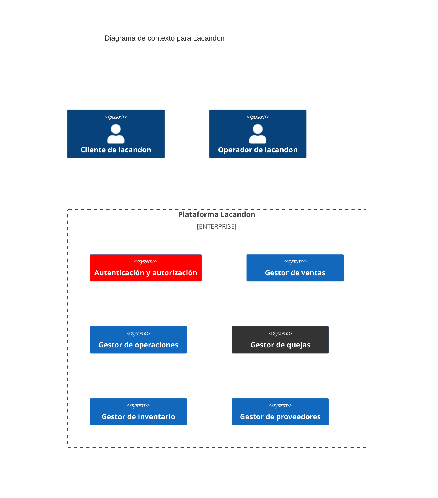

# Lacandon

En la siguiente figura, se muestra el modelo de dominio simplificado para el proyecto de lacando:

Diagrama de estados para el carrito de compra

Diagrama de estados para la administración de una queja

