# Análisis y diseño

## Diagrama de contexto para la plataforma

Un Diagrama de Contexto de Sistema (DCS) en Ingeniería de software e Ingeniería de sistemas es un diagrama que define los límites entre el sistema, o parte del sistema, y su ambiente, mostrando las entidades que interactúan con él.2​ Este diagrama es una vista de alto nivel de un sistema.

A continuación se muestra el diagrama de contexto para **Lacandon**:

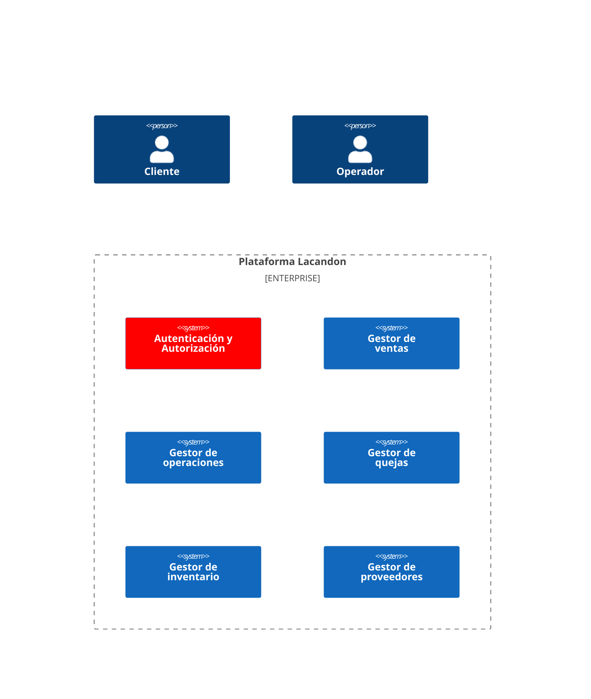

Funcionalidades del **Cliente**

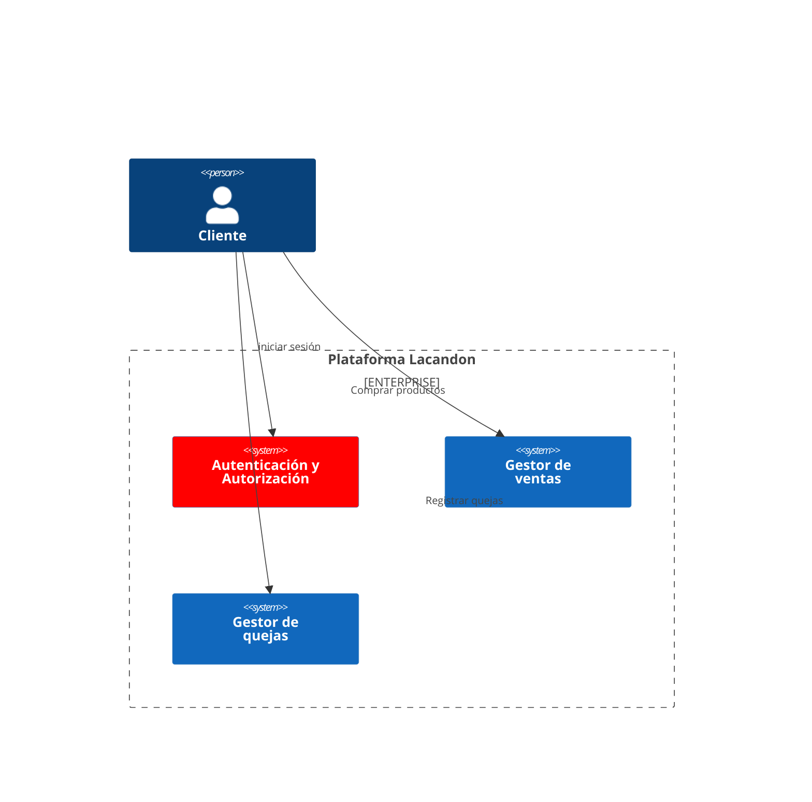

## Casos de uso

Los casos de uso son modelos que describen cómo los usuarios interactúan con un sistema. Se representan mediante diagramas de casos de uso. 

A continuación se presentan los macro casos de uso que conforman a la plataforma lacandon

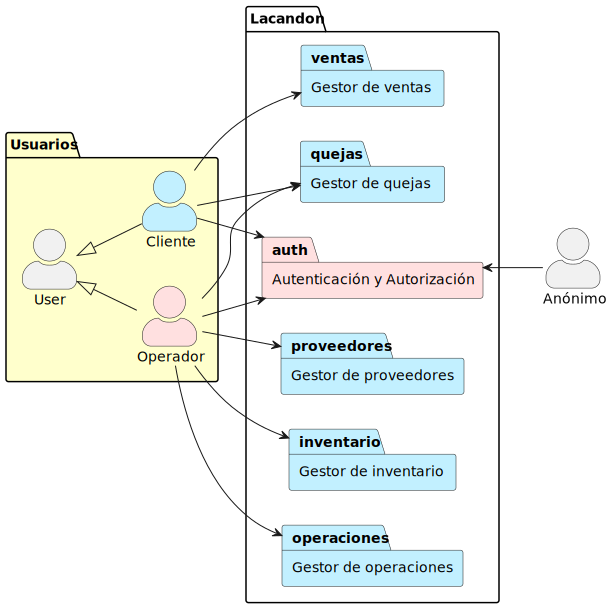

### Autenticación y autorización

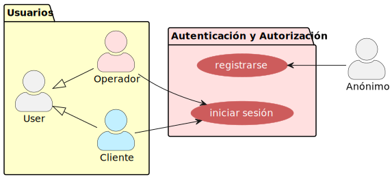

### Gestor de proveedores

Registro de proveedor

Como Operador, quiero registrar un proveedor, con la finalidad de mantener un registro actualizado de los proveedores de la empresa

Consulta de proveedores

Como Operador, quiero consultar la lista de proveedores que tenemos registrados, con la finalidad de administrarlos y mantener un registro actualizado.

Como Operador, quiero consultar el detalle de un proveedor, con la finalidad de visualizar la información y verificar que está actualizada.

Como operador, quiero dar de baja a un proveedor, con la finalidad de mantener actualizado el registro de proveedores vigentes de la empresa.

### Gestor de inventario

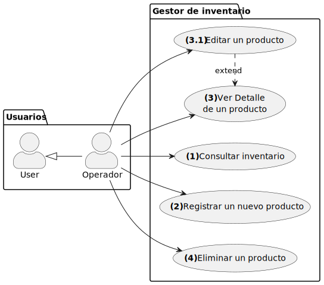

### Gestor de Ventas

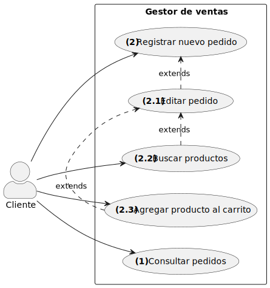

Registro de pedidos:

Como Cliente,  quiero buscar un producto dentro del sistema, con la finalidad de comprarlo o agregarlo a mi carrito de compra.

Como Cliente,  quiero agregar un producto a mi carrito de compra, con la finalidad de comprarlo o apartarlo para más tarde

Como Cliente,  quiero consultar el contenido de mi carrito de compra, con la finalidad de administrar su contenido o proceder a su compra.

Como Cliente,  quiero quitar un producto de mi carrito de compra, con la finalidad de que no sea procesado durante el pago de mi cuenta.

Como Cliente,  quiero ver el detalle de un producto, con la finalidad de verificar que es el más adecuado para comprar

Como Cliente,  quiero ver el detalle de un producto, con la finalidad de verificar que es el más adecuado para comprar.

Como Cliente,  quiero ver el detalle de un producto, con la finalidad de verificar que es el más adecuado para comprar.

Como Cliente,  quiero llevar a cabo la compra de los productos contenidos en mi carrito, con la finalidad de adquirirlos y pagar por ellos.

Como Cliente,  quiero registrar la dirección a la que me deberán de llegar mis productos, con la finalidad de que mis productos lleguen al lugar correcto.

Consulta de pedidos

Como Cliente,  quiero consultar la lista de pedidos que he realizado, con la finalidad de consultar el estado en el que se encuentra cada uno y poder administrarlos.

Como Cliente,  quiero consultar el detalle de un pedido, con la finalidad de revisar los productos que he comprado y el estado de mi pedido.

### Gestor de operaciones

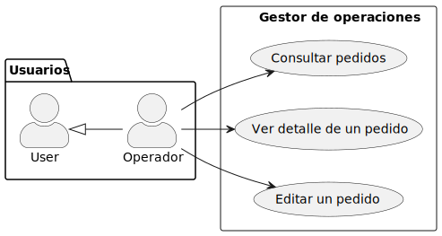

Consulta de pedidos

Como Operador,  quiero consultar la lista de pedidos que se han realizado, con la finalidad de administrarlos y proceder a su repartición.

Como Operador,  quiero ver el detalle de un pedido, con la finalidad de ver los productos que se han solicitado y el estado en el que se encuentra el pedido.
Como Operador,  quiero ver el detalle de un pedido, con la finalidad de ver los productos que se han solicitado, consultar el estado en el que se encuentra el pedido y actualizarlo.

Como Operador,  quiero actualizar el estado de los pedidos que se encuentran en enviado y pasarlos al estado de enviado, con la finalidad de dar seguimiento al pedido.

Como Operador,  quiero cancelar un pedido, con la finalidad de que no sea procesado ni enviado a su destino.

### Gestor de quejas

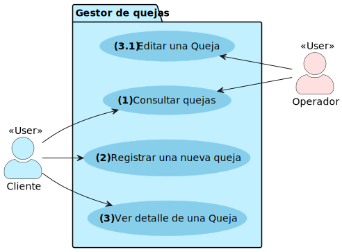

Registro de quejas

Como Cliente, quiero registrar una queja, con la finalidad de reportar un incumplimiento, reportar un mal funcionamiento de un producto o simplemente expresar mi opinión sobre el servicio y atención que se me oficio. 

Consulta de quejas

Como Cliente, quiero consultar la lista de quejas que he levantado, con la finalidad de administrarlas y darles seguimiento.

Como Cliente, quiero consultar el estado en el que se encuentra una de mis quejas y la respuesta que se le pudo dar, con la finalidad de estar informado con el estado de mi queja.

Como Operador, quiero consultar la lista de quejas que se han levantado, con la finalidad de administrarlas y darles seguimiento.

Como Operador, quiero realizar una búsqueda parametrizada de las quejas que han llegado hasta el momento , con la finalidad de darles seguimiento y brindar atención oportuna.

Como Operador, quiero ver el detalle de una queja, con la finalidad de darles seguimiento.

Como Operador, quiero editar el detalle de una queja, con la finalidad de darle respuesta y mantener comunicación con nuestros clientes.

## Modelo de dominio

Un modelo de dominio es una representación de los conceptos, reglas y relaciones que definen un dominio de problema.

En la siguiente figura, se muestra el modelo de dominio simplificado para la plataforma **Lacandon**:

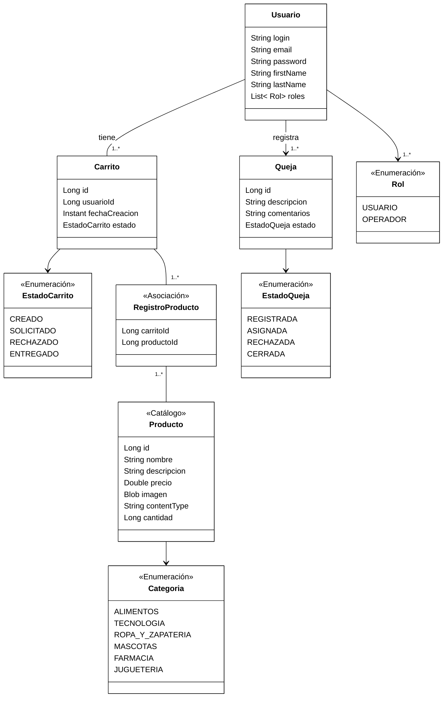

## Diagrama de estados

El diagrama de estados es un diagrama de comportamiento usado para especificar el comportamiento de una parte del sistema diseñado a través de transiciones de estados finitos. Es utilizado para mostrar los estados por los que pasa un componente de un sistema de información.

### Diagrama de estados para el carrito de compra

A continuación se muestra el diagrama de estados para el Objeto **Carrito de Compra**

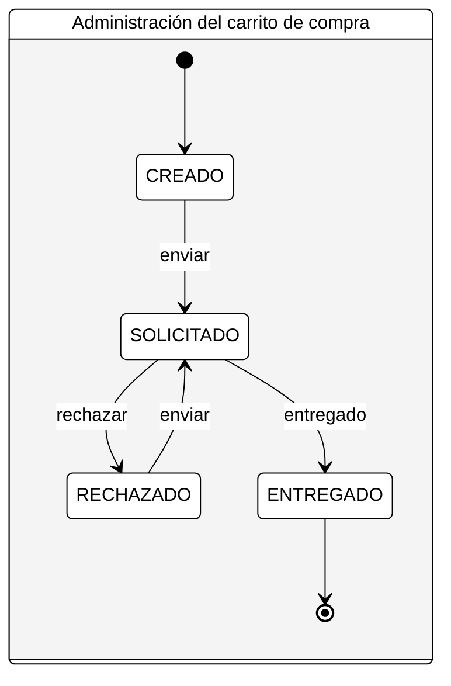

### Diagrama de estados para la administración de una queja

A continuación se muestra el diagrama de estados para el Objeto **Queja**

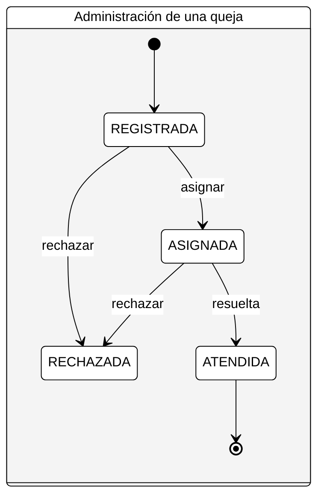
