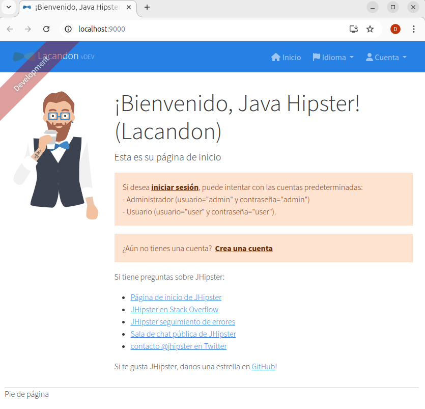
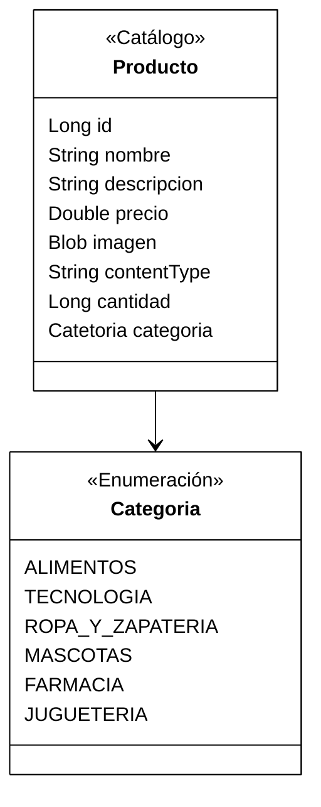
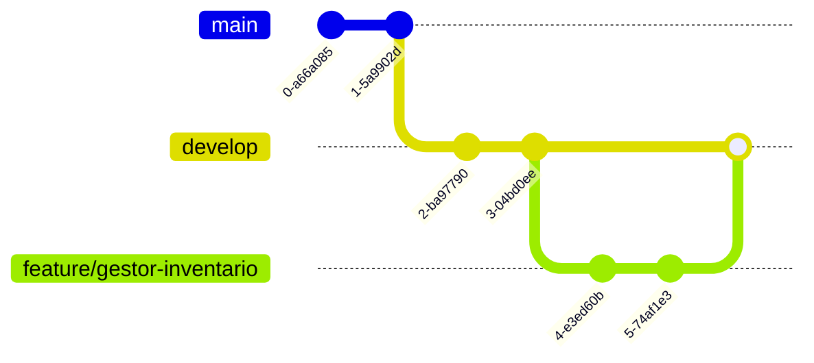
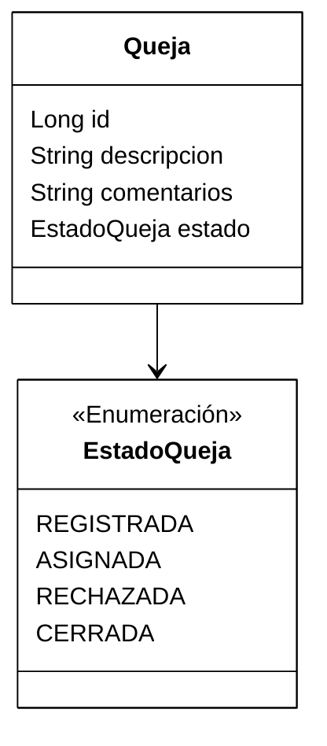
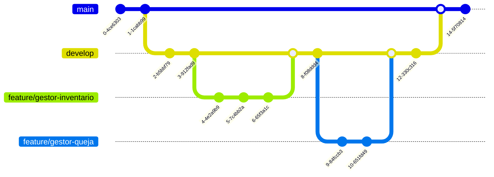
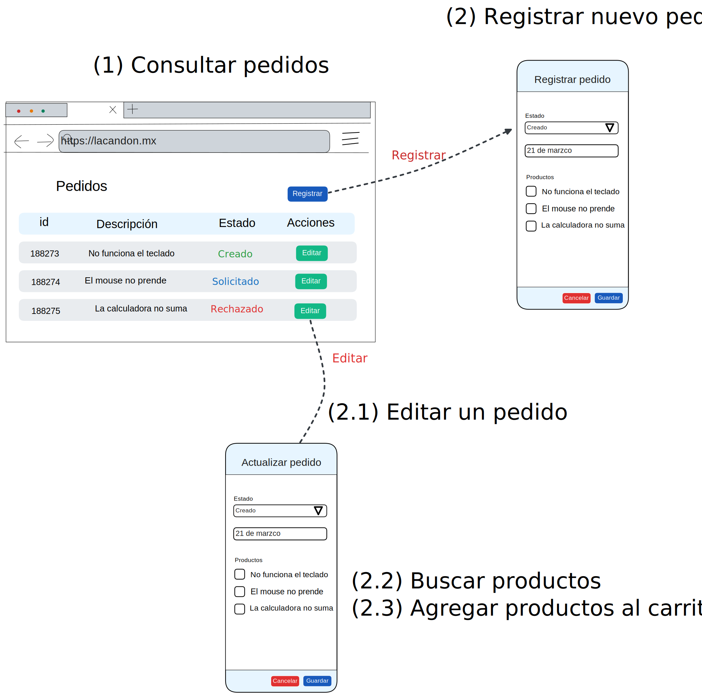
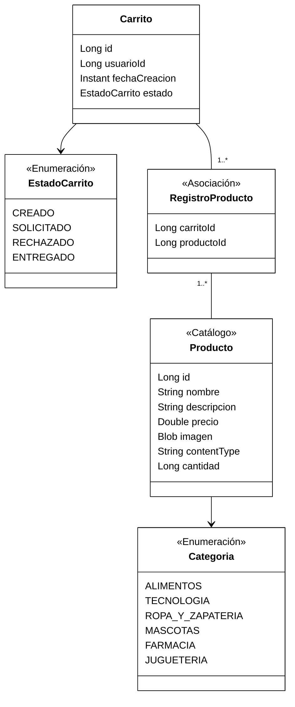
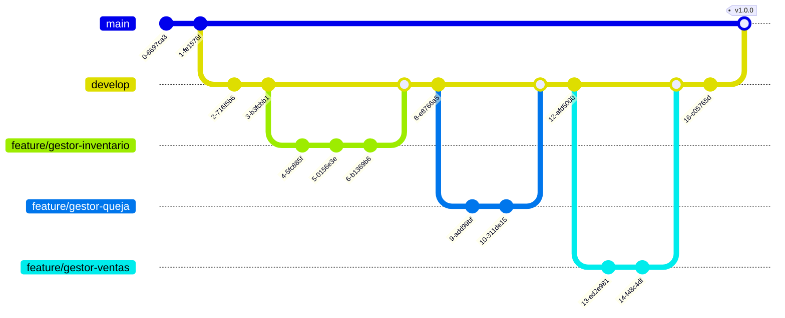

# :construction: Implementación

## Pre-requisitos

Antes de comenzar, deberás de verificar que tienes instalados los siguientes elementos:

- [Open JDK 17](https://openjdk.org/projects/jdk/17/) o mayor
- [Docker](https://www.docker.com/get-started/) _(Opcional)_
- [Git](https://git-scm.com/downloads)
- [VSCode](https://code.visualstudio.com/download)
- [Node 22.14.0 y NPM 10.9.2](https://nodejs.org/en) o superior
  - [Utilizar NVM](https://github.com/nvm-sh/nvm) _(Opcional)_
- [PosgreSQL](https://www.postgresql.org/download/) _(Opcional si tienes docker)_
- Algún cliente Rest como: [Insomnia](https://insomnia.rest/), [Postman](https://www.postman.com/) o [CURL](https://curl.se/)

Siempre hay que instalar la **versión LTS** de cada componente.

## Instalación de JHIPSTER

[Jhipster](https://www.jhipster.tech/) es un framework de desarrollo para la generación de código que, como herramienta y base de código, ayudan a ahorrar mucho tiempo en el desarrollo de proyectos. Jhipster genera aplicaciones con los frameworks más populares de desarrollo frontend y backend de la actualidad. Su proyecto se basa en el código abierto e integra componentes como Spring Boot, AngularJS o Bootstrap, que son imprescindibles a la hora de crear aplicaciones web modernas y aplicaciones basadas en microservicios.

Para instalar Jhipster, debe ejecutar el siguiente comando:

```shell
npm install -g generator-jhipster
```

## Descargar el proyecto desde Github

En alguna ruta de tu máquina local, crea una carpeta llamada `bootcamp` y colocate en ella, por ejemplo: `/home/daniel/bootcamp`.

Descargar el proyecto lacandon con el siguiente comando:

```shell
git clone https://github.com/calmecac-community/lacandon.git
```

Cambiate al nuevo directorio con el comando:

```shell
cp lacandon
```

¡Listo!

## Levantar la base de datos PostgreSQL

jdbc:postgresql://localhost:5432/lacandon
Asegurate que tienes instalada, en tu máquina local, la base de datos `PostgreSQL` y escuchando por el puerto `5432`

> **Utilizar Docker _(Opcional)_**
>
> Sí tienes instalado `Docker`, puedes utilizar la versión de postgreSQL que viene en el archivo `postgresql.yml` y levantar la base de datos con el siguiente comando: `docker compose -f src/main/docker/postgresql.yml up -d`

## Levantar el proyecto

El proyecto consta de dos principales componentes: **Backend **y **Frontend**.

### Levantar el backend

Ejecuta el siguiente comando:

```
./mvnw
```

Si todo resulta bien, en la consola deberá de ver una salida parecida a la siguiente:

```shell
2025-03-10T12:39:17.917-06:00  INFO 55537 --- [  restartedMain] mx.calmecac.lacandon.LacandonApp         :
----------------------------------------------------------
        Application 'lacandon' is running! Access URLs:
        Local:          http://localhost:8080/
        External:       http://127.0.1.1:8080/
        Profile(s):     [dev, api-docs]
----------------------------------------------------------
```

A partir de ahora, puedes acceder al API del proyecto en la URL `http://localhost:8080/`

### Levantar el frontend

Abre una nueva terminal en la ruta que se encuentra el proyecto (ejemplo, `/home/daniel/bootcamp/lacandon`) y ejecuta el siguiente comando:

```shell
./npmw start
```

Si todo sale bien, podrás ver el proyecto en un navegador web en la ruta:

http://localhost:9000/



Intenta iniciar sesión con las siguientes credenciales:

```shell
usuario: admin
password: admin
```

# :tada: ¡Felicidades!

Has logrado terminar la primera actividad del proyecto final.

## Implementación del Gestor de inventario

### Caso de uso

El **gestor de inventario** se encuentra definido en el documento [Gestor de inventario](../doc/analisis.md). En resúmen, tenemos que implementar el caso de uso y las pantallas que lo acompañan:


### Pantallas

Las pantallas que conforman el caso de uso son:


### Modelo de dominio

El modelo de dominio que brinda persistencia al caso de uso es el siguiente:



### Vista en Git



### Actividad

Sigue las instrucciones para generar este módulo utiizando **Jhipster**

1. Crea el módelo de dominio para la entidad Producto(Inventario) utilizando el modelador [JDL Studio](https://start.jhipster.tech/jdl-studio/)
2. En tu proyecto local de git, crear una nueva rama llamada `feature/gestor-inventario`con el siguiente comando `git checkout -b feature/gestor-inventario`
3. Descarga modelo generado en la raiz del proyecto y guardalo con el nombre `entities.jdl`
4. Genera las pantallas, backend y base de datos con el comando `jhipster import-jdl entities.jdl`
5. En una terminal, levanta el backend con el comando `./mvnw`
6. En otra terminal, levanta el frontend con el comando `./npmw start`
7. Prueba el aplicativo genearado en un navegador web en la ruta [http://localhost:9000](http://localhost:9000)
8. Si todo está correcto, crea un commit de tu código generado con el commando `git add .` y después `git commit -m "Se agrega el gestor de inventario"`

# :tada: ¡Felicidades!

Has logrado generar tu primer componente utlizando **Jhipster**.

## Implementación del Gestor de quejas

### Caso de uso

El **gestor de quejas** se encuentra definido en el documento [Gestor de quejas](../doc/analisis.md). En resúmen, tenemos que implementar el caso de uso y las pantallas que lo acompañan:


### Pantallas

Las pantallas que conforman el caso de uso son:


### Modelo de dominio

El modelo de dominio que brinda persistencia al caso de uso es el siguiente:



### Vista Git



### Actividad

Sigue las instrucciones para generar este módulo utiizando **Jhipster**

1. Actualizar el archivo `entities.jdl` con la entidad de Quejas y su respectivo estado de acuerdo con el diagrama de dominio.
2. Genera las pantallas, backend y base de datos con el comando `jhipster import-jdl entities.jdl`
3. En una terminal, levanta el backend con el comando `./mvnw`
4. En otra terminal, levanta el frontend con el comando `./npmw start`
5. Prueba el aplicativo genearado en un navegador web en la ruta [http://localhost:9000](http://localhost:9000)
6. Si todo está correcto, crea un commit de tu código generado con el commando `git add .` y después `git commit -m "Se agrega el gestor de quejas"`

# :tada: ¡Felicidades!

Has logrado generar tu primer componente utlizando **Jhipster**.


## Implementación del Gestor de ventas

### Caso de uso

El **gestor de ventas** se encuentra definido en el documento [Gestor de ventas](../doc/analisis.md). En resúmen, tenemos que implementar el caso de uso y las pantallas que lo acompañan:


### Pantallas

Las pantallas que conforman el caso de uso son:



### Modelo de dominio

El modelo de dominio que brinda persistencia al caso de uso es el siguiente:



### Vista Git



### Actividad

Sigue las instrucciones para generar este módulo utiizando **Jhipster**

1. Actualizar el archivo `entities.jdl` con las entidades requeridas por el gestor de ventas. Utilizar el diagrama de dominio como referencia.
2. Genera las pantallas, backend y base de datos con el comando `jhipster import-jdl entities.jdl`
3. En una terminal, levanta el backend con el comando `./mvnw`
4. En otra terminal, levanta el frontend con el comando `./npmw start`
5. Prueba el aplicativo genearado en un navegador web en la ruta [http://localhost:9000](http://localhost:9000)
6. Si todo está correcto, crea un commit de tu código generado con el commando `git add .` y después `git commit -m "Se agrega el gestor de ventas"`

# :tada: ¡Felicidades!

Has logrado generar tu primer componente utlizando **Jhipster**.
